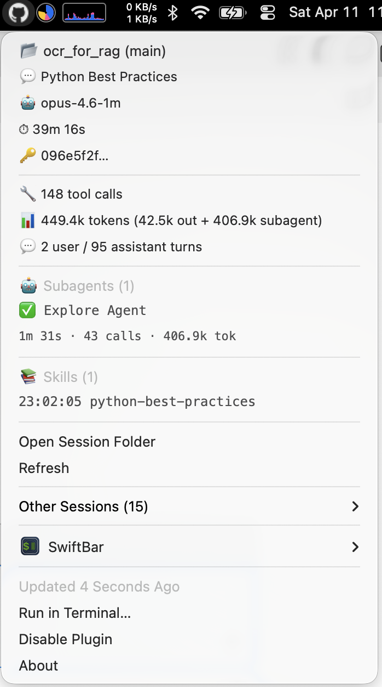

# CoMonitor — GitHub Copilot CLI Menu Bar Monitor

A macOS menu bar plugin that shows real-time status of your [GitHub Copilot CLI](https://docs.github.com/en/copilot/github-copilot-in-the-cli) sessions. Built for [SwiftBar](https://github.com/swiftbar/SwiftBar) (also compatible with [xbar](https://xbarapp.com)).


## What It Shows

- **Active session** — repository, branch, model, and duration
- **Tool calls** — total count across all tools used
- **Token usage** — combined output + subagent tokens
- **Conversation turns** — user and assistant message counts
- **Todos** — in-progress / pending / blocked / done items pulled live from the per-session `session.db` SQLite store, with a drill-down for the full list
- **Subagents** — active and completed subagents with duration, tool calls, and token stats
- **Skills** — invoked skills with timestamps
- **Inbox** — agent-to-agent inbox messages from `session.db` (unread items bolded)
- **Hooks & MCP health** — recent `hook.end` failures and any failed MCP server connections; a ⚠️ replaces the menu-bar icon while problems are active
- **Running tools** — currently executing tool calls
- **Other sessions** — all other active Copilot CLI sessions in a submenu; click any session to switch the primary display to it (pin), and reset back to auto-selection at any time

The GitHub Invertocat icon appears in your menu bar when a session is active. A grey dot shows when no sessions are running, and ⚠️ appears when the active session has hook or MCP failures.



## Prerequisites

- **macOS** (required — SwiftBar/xbar are macOS-only)
- **[Bun](https://bun.sh)** (recommended), [tsx](https://github.com/privatenumber/tsx), or Node.js — any TypeScript runtime
- **GitHub Copilot CLI** — the agent must be running to produce session data

## Installation

### 1. Install SwiftBar

```bash
brew install --cask swiftbar
```

Launch SwiftBar from `/Applications` and set a plugin directory when prompted (e.g. `~/Library/Application Support/SwiftBar/Plugins`).

### 2. Install Bun (if not already installed)

```bash
brew install oven-sh/bun/bun
```

### 3. Install the plugin

```bash
git clone https://github.com/eggboy/comonitor.git
cd comonitor/scripts
./install-menubar.sh
```

The install script will:
1. Detect your SwiftBar or xbar installation (or offer to install SwiftBar via Homebrew)
2. Symlink the plugin and helper script into your plugins directory
3. Make scripts executable

The monitor should appear in your menu bar within 5 seconds.

### Manual Installation

If you prefer to install manually, symlink both files into your SwiftBar plugins directory:

```bash
PLUGINS_DIR="$(defaults read com.ameba.SwiftBar PluginDirectory)"
ln -s "$(pwd)/copilot-monitor.5s.sh" "$PLUGINS_DIR/copilot-monitor.5s.sh"
ln -s "$(pwd)/copilot-menubar.ts" "$PLUGINS_DIR/copilot-menubar.ts"
chmod +x copilot-monitor.5s.sh copilot-menubar.ts
```

## Uninstallation

```bash
cd comonitor/scripts
./uninstall-menubar.sh
```

This removes the symlinks from SwiftBar/xbar's plugins directory. The source files are left untouched.

To also remove SwiftBar:

```bash
brew uninstall --cask swiftbar
```

## How It Works

```
SwiftBar (every 5s)
  └─► copilot-monitor.5s.sh   (bash wrapper — sets PATH, finds runtime)
        └─► copilot-menubar.ts  (TypeScript — parses session data, outputs SwiftBar text)
```

1. **SwiftBar** executes `copilot-monitor.5s.sh` every 5 seconds (the `5s` in the filename controls the refresh interval)
2. The **shell wrapper** sets up the PATH (Homebrew paths aren't available by default in SwiftBar) and delegates to the TypeScript helper using `bun`, `tsx`, or `npx tsx`
3. The **TypeScript helper** reads Copilot CLI's session state from `~/.copilot/session-state/`:
   - `workspace.yaml` — repository, branch, working directory, summary
   - `events.jsonl` — streaming event log with session start, messages, tool executions, subagent activity, skill invocations, hook outcomes, MCP connect/fail status, etc.
   - `session.db` — per-session SQLite store opened **read-only** for the todo list and agent inbox (Bun's built-in `bun:sqlite`, with a Node 22+ `node:sqlite` fallback; sessions whose runtime lacks SQLite simply skip those sections)
   - `inuse.*.lock` — lock files indicating an actively running session
4. Derived stats are cached at `~/.copilot/.comonitor-cache/<sessionId>.json`. On each tick the helper tail-reads only the new bytes appended to `events.jsonl`, so the 5 s budget stays tight even when the session-state directory has hundreds of historical sessions. Cache entries for deleted sessions are pruned automatically.
5. Sessions are sorted by lock status (active first) then recency. The most recent active session gets the full display; other active sessions appear in a compact submenu
6. Output follows the [SwiftBar plugin format](https://github.com/swiftbar/SwiftBar#plugin-api): pipe-delimited lines with styling parameters

## Configuration

The refresh interval is controlled by the filename. Rename the plugin to change it:

| Filename | Refresh Rate |
|---|---|
| `copilot-monitor.5s.sh` | Every 5 seconds (default) |
| `copilot-monitor.10s.sh` | Every 10 seconds |
| `copilot-monitor.30s.sh` | Every 30 seconds |

## Limitations

- **Copilot CLI only** — This monitors [GitHub Copilot in the CLI](https://docs.github.com/en/copilot/github-copilot-in-the-cli) (the terminal agent). It does **not** monitor Copilot Chat in VS Code, JetBrains, or other editors, as those use different session state mechanisms.
- **macOS only** — SwiftBar and xbar are macOS applications. There is no Linux or Windows support.
- **No live context-window meter** — Copilot CLI only emits authoritative token counts in `session.compaction_*` and `session.shutdown` events, so a useful live readout isn't possible before the first compaction. Per-turn events carry `outputTokens` only. The monitor reports cumulative output + subagent tokens instead.
- **Todos / inbox require an SQLite-capable runtime** — Bun has `bun:sqlite` built in (recommended). Node 22 needs `--experimental-sqlite`; Node 24+ has `node:sqlite` enabled by default. Without one of those, the Todos and Inbox sections are hidden silently; the rest of the monitor continues to work.
- **Read-only** — The monitor only reads session state files. It cannot control, pause, or interact with Copilot CLI sessions.
- **Session discovery** — Sessions are discovered from `~/.copilot/session-state/`. If the Copilot CLI changes its session storage location or format, the monitor will need to be updated.

## License

MIT
